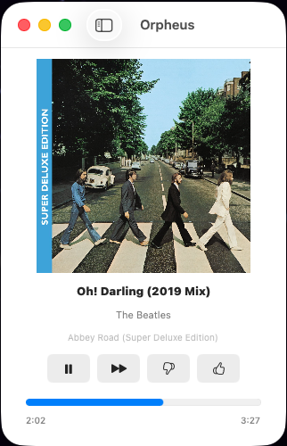
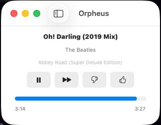
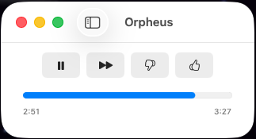

# Orpheus

Native macOS Pandora client built on [pianobar](https://github.com/promyloph/pianobar).
Spiritual successor to [Hermes](https://hermesapp.org/), which doesn't run on
modern macOS anymore.

Menu-bar presence, Now Playing widget, media-key control, notifications,
station list, thumbs / tired / bookmark, history, auto-resume of last station,
and an experimental pause-on-quit / resume-on-launch mode.

## Screenshots

The window progressively hides content as you shrink it, so it can sit anywhere
from a full now-playing card down to a small transport strip.

**Full** — album art, song, artist, album, transport, and progress.



**Condensed** — art hides, metadata and controls remain.



**Minimal** — just the transport row and progress bar.



## Install (personal use)

```bash
git clone git@github.com:wweaver/orpheus.git
cd orpheus
brew install pianobar xcodegen
./scripts/install.sh
```

`scripts/install.sh` builds Release, drops `Orpheus.app` into `~/Applications/`,
and launches it. After that, find it via Spotlight (`⌘Space` → "Orpheus"),
the Dock, or Launchpad like any other Mac app.

To rebuild after pulling new code:

```bash
git pull
./scripts/install.sh
```

## Requirements

- macOS 13 Ventura or later (Intel or Apple Silicon).
- An active Pandora account.
- `pianobar` installed on the dev machine (`brew install pianobar`). Plan 3
  in `docs/superpowers/plans/` describes how to bundle it inside the `.app`
  for distribution; that work is parked because this is a personal-use build.

## Project layout

```
App/                    Xcode app target — SwiftUI views, menu bar, prefs.
Packages/PianobarCore/  Swift Package — all logic, full test suite.
scripts/                Build/install helpers (install.sh, make-icon.sh).
docs/superpowers/       Design spec, implementation plans, QA checklists.
```

## Development

```bash
brew install xcodegen
xcodegen generate
cd Packages/PianobarCore && swift test     # 32 tests
open ../../PianobarGUI.xcodeproj           # to develop in Xcode
```

The Xcode project filename is still `PianobarGUI.xcodeproj` and a few
internal Swift types (`PianobarGUIApp`, the `PianobarCore` package) keep
the original working title — only externally visible identity (display
name, window title, menu items, install path) changed to Orpheus.

## Status

Plans 1 and 2 are complete; Plan 3 (packaging — bundle pianobar, sign,
notarize, DMG, Sparkle auto-update) is written but not executed because
distribution to other users would need an Apple Developer account.

Open `docs/superpowers/plans/` for implementation history.

## Why "Orpheus"?

Greek myth's legendary musician played the lyre, often loud enough to charm
trees and rivers. Same naming family as Hermes — fitting for the app filling
its shoes — and a music-flavored nod that doesn't trade on Pandora's brand.
