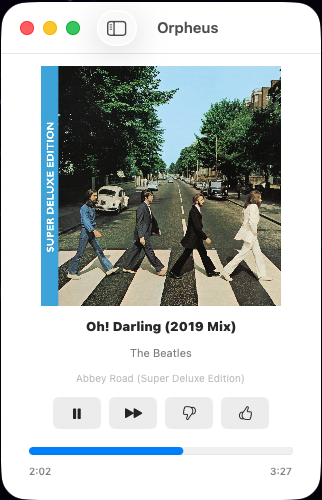
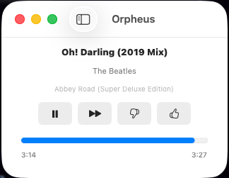
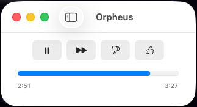
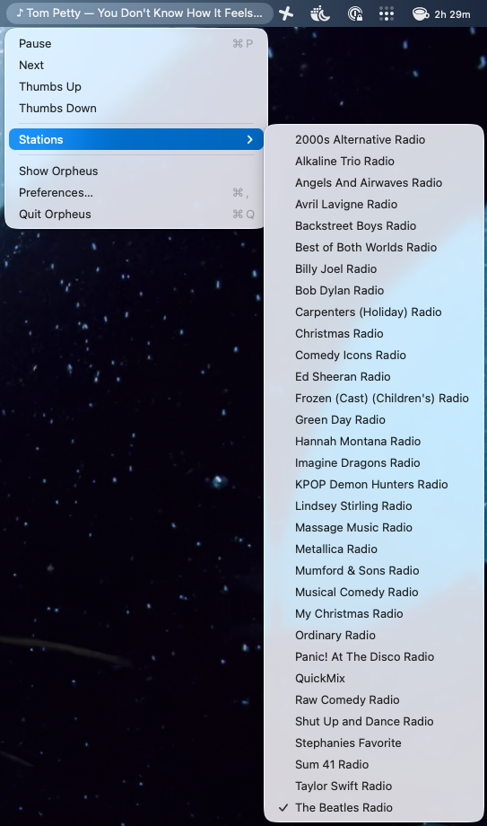

# Orpheus

Native macOS Pandora client built on [pianobar](https://github.com/promyloph/pianobar).
Spiritual successor to [Hermes](https://hermesapp.org/), which doesn't run on
modern macOS anymore.

Menu-bar presence, desktop widget, Now Playing widget, media-key control, notifications,
station list with filter, thumbs / tired / bookmark, played-song history,
volume, global and in-app keyboard shortcuts, auto-resume of last station,
and an experimental pause-on-quit / resume-on-launch mode.

## Screenshots

The window progressively hides content as you shrink it, so it can sit anywhere
from a full now-playing card down to a small transport strip.

**Full** — album art, song, artist, album, transport, and progress.



**Condensed** — art hides, metadata and controls remain.



**Minimal** — just the transport row and progress bar.



**Menu bar** — Now Playing title, quick actions, and the full station list one click away.



## Keyboard shortcuts

In-app, under the **Controls** menu:

| Action | Shortcut |
| --- | --- |
| Play / Pause | ⌘⇧P |
| Next Song | ⌘⇧N |
| Thumbs Up / Down | ⌘⇧U / ⌘⇧D |
| Tired of Song | ⌘⇧T |
| Bookmark Song | ⌘⇧B |

System-wide hotkeys (off by default) are bound in **Preferences → Hotkeys**:
click a shortcut, press the keys, include at least one modifier.

## Install (personal use)

```bash
git clone git@github.com:wweaver/orpheus.git
cd orpheus
brew install pianobar xcodegen
./scripts/make-signing-cert.sh   # once — see below
./scripts/install.sh
```

`scripts/make-signing-cert.sh` creates a self-signed code-signing certificate
in your login keychain. Without it the app is signed ad-hoc, which gives it a
designated requirement of a bare code hash that changes on every build — so
macOS treats each reinstall as a different app, the keychain stops handing over
your saved Pandora credentials, and you have to sign in again after every
install.

It's optional. The project signs ad-hoc by default, so a fresh clone builds
anywhere including straight from Xcode; `install.sh` uses the stable identity
only when the certificate exists. The trade-off is that binding credentials to
a stable identity also means anything running code as you could sign a bundle
claiming the same identifier and read the stored password without a prompt —
reasonable for a personal-use app, but skip the script if you'd rather not.

`scripts/install.sh` builds Release, drops `Orpheus.app` into `~/Applications/`,
and launches it. After that, find it via Spotlight (`⌘Space` → "Orpheus"),
the Dock, or Launchpad like any other Mac app.

To rebuild after pulling new code:

```bash
git pull
./scripts/install.sh
```

## Requirements

- macOS 13 Ventura or later (Intel or Apple Silicon).
- An active Pandora account.
- `pianobar` installed on the dev machine (`brew install pianobar`). Plan 3
  in `docs/superpowers/plans/` describes how to bundle it inside the `.app`
  for distribution; that work is parked because this is a personal-use build.

## Project layout

```
App/                    Xcode app target — SwiftUI views, menu bar, prefs.
Widget/                 WidgetKit extension — desktop widget, three sizes.
Shared/                 Snapshot + command types compiled into both targets.
Packages/PianobarCore/  Swift Package — all logic, full test suite.
scripts/                Build/install helpers (install.sh, make-icon.sh).
docs/superpowers/       Design spec, implementation plans, QA checklists.
```

### Desktop widget

Small, medium and large. Cover art, title, artist, station, progress, and
play/pause, skip and thumbs buttons — large adds the album line and "tired of
this song".

Two things about it are worth knowing before changing anything:

- **It is not backed by an App Group**, despite that being the obvious choice.
  Orpheus signs with an untrusted self-signed certificate and no Developer Team
  (see `scripts/make-signing-cert.sh`), so `secinitd` brings the extension's
  sandbox up as `signer:none` and never maps a group container — the path
  resolves, but every read off it is denied. Instead the app publishes to
  `~/Library/Application Support/PianobarGUI/Widget/` and the extension holds a
  read-only sandbox *temporary exception* for it, which is granted from the
  entitlement rather than the signing identity. `OrpheusShared.sharedDirectory`
  and `Widget/OrpheusWidget.entitlements` must agree on that path.

- **Buttons only work while Orpheus is running**, because pianobar is a child of
  the app. Presses travel back as distributed notifications, which a sandboxed
  extension is allowed to post; `WidgetBridge` turns them into `PianobarCtrl`
  calls. Quitting (and signing out) blanks the snapshot entirely, so the widget
  falls back to "Nothing playing" instead of advertising a song that stopped
  with the app and won't resume on the next launch. If the app dies without
  running its termination hook the stale snapshot survives, and the widget
  notices via `isLive()` — `appRunning`, plus a track that has outlived its own
  duration by more than the grace period — and hides the transport rather than
  dropping presses silently.

Entitlements are applied after the build by `scripts/sign-entitlements.sh`
(invoked from `install.sh`), not via `CODE_SIGN_ENTITLEMENTS` — declaring them
in the project makes Xcode's manual signing path demand a provisioning profile,
and therefore a Developer Team.

## Development

```bash
brew install xcodegen
xcodegen generate
cd Packages/PianobarCore && swift test     # 55 tests
open ../../PianobarGUI.xcodeproj           # to develop in Xcode
```

The Xcode project filename is still `PianobarGUI.xcodeproj` and a few
internal Swift types (`PianobarGUIApp`, the `PianobarCore` package) keep
the original working title — only externally visible identity (display
name, window title, menu items, install path) changed to Orpheus.

## Status

Plans 1 and 2 are complete; Plan 3 (packaging — bundle pianobar, sign,
notarize, DMG, Sparkle auto-update) is written but not executed because
distribution to other users would need an Apple Developer account.

Open `docs/superpowers/plans/` for implementation history.

## Why "Orpheus"?

Greek myth's legendary musician played the lyre, often loud enough to charm
trees and rivers. Same naming family as Hermes — fitting for the app filling
its shoes — and a music-flavored nod that doesn't trade on Pandora's brand.
